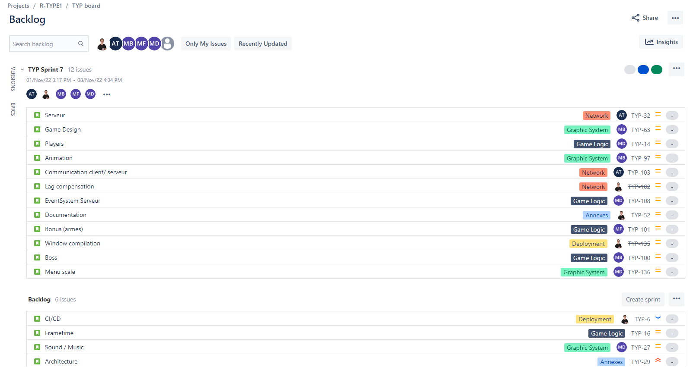
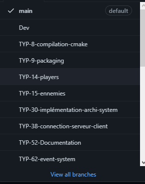
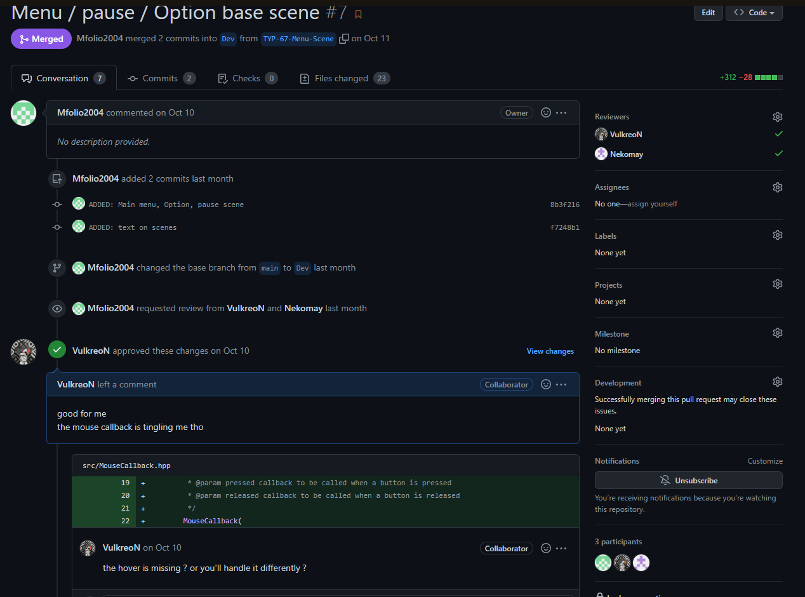

# Developer Documentation

## **Introduction**

This project is developed in C++ using the SFML library for the graphical part and Asio for the Network part.

there is a link to their documentation below:
- [ASIO](https://think-async.com/Asio/asio-1.24.0/doc/)
- [SFML](https://www.sfml-dev.org/documentation/2.5.1/)

## **Architecture**

Here is the current architecture of the project:


## **How to build**

### **Requirements**
- python3
- pip3

```
Actually, the project is built using a python script (build.py).
The script will install the requirements and build the project.
It's also possible to build the project manually, with cmake.
You can find the cmake file in the root of the project.
```

## **where to start**

The project is managed through Jira, you can find the link to the board below:
- [Jira](https://r-type.atlassian.net/jira/software/projects/RTP/boards/1)

You'll find in there all the tasks that need to be done, and the current sprint status like so.



The project is also managed through Github, you can find the link to the repository below:

- [Github](https://github.com/Mfolio2004/R-TYPE)

You'll find in there all the commits, the issues and the pull requests.

***

## **Pull Request**

We work with pull requests, to contribute to the project you'll need to create a pull request.

To contribute you'll need to create a branch from the `Dev` branch.
Your Branch name should be using the ID of your Jira Task like so `TYP-XXX-Issue-Name`.

When you'll finish your work you'll have to create a pull request to merge your branch into the `Dev` branch.



Assign 2 reviewers to your pull request, and wait for them to review your code, the last of the two reviewers will merge it if it's approved.

*important note:*
```
you cannot assign yourself to review your pull request.
also all the comments should be in english.
```


### **Commit Norm**

We follow a specific commit message format, you can find it below:

```
Conjugated verb in preterit form and in upper case
> [TYPE]: [MESSAGE]
    Examples: > FIX: Fixed Network lag input
             > ADD: Added New boss on stage 3
```

***

## **Network Protocol**

The network protocol is based on the UDP protocol, we use the Asio library to handle the network part.

Here is the current network protocol:

- [NetworkProtocol](./NetworkProtocol.md) (WIP)
